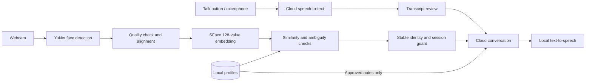

# Saathi — Face Recognition & Voice Assistant

A Python desktop prototype that recognizes enrolled people from a live webcam, greets them by name, and connects them to a cloud conversation model. Face inference and profile storage run locally. Microphone audio is sent to OpenAI only when **Talk** is selected and cloud conversation is enabled.

## Quick start

Install Python 3.11 or newer with Tk support. Download or clone this repository, then run **`setup.bat`** to create the environment, install dependencies, and download the verified face models. Model weights and personal data are not included in the repository.

1. Double-click **`start.bat`**.
2. Click **Start camera**. Stand alone in view, with your face clearly lit.
3. Click **Enroll a face**, enter your name, and check the enrollment permission box. Ten good face samples are collected over several seconds. Turn slightly left and right while keeping your face visible.
4. Once recognized, the app greets you with the system voice. Leave and return to test recognition; greetings have a 90-second cooldown.
5. Open **Settings**, enter your OpenAI API key, and enable cloud conversation. The key is held in memory, not written to a file. `OPENAI_API_KEY` is also supported.
6. Type a message and click **Send**, or click **Talk** for a six-second recording. Review/correct the transcript, then click **Send**. Introduce yourself with `My name is Saiyam` to open the enrollment confirmation.
7. Say/type `Remember that I study computer science`. Review the exact note and approve it. Notes persist across restarts and are used in future conversations.

For a fresh installation, install Python 3.11 or newer with Tk support, then run **`setup.bat`**. This checkout was tested with Python 3.14 on Windows. Setup downloads Python dependencies and approximately 39 MB of face weights; it does not download a new Python runtime.

`requirements-lock.txt` records the tested Windows dependency versions, and `setup.bat` installs those first. Other operating systems should use the package dependencies in `pyproject.toml` rather than the Windows lock file.

PowerShell alternative, from this directory:

```powershell
python -m venv .venv
.venv\Scripts\python.exe -m pip install -e .
.venv\Scripts\python.exe -m saathi download-models
.venv\Scripts\python.exe -m saathi run
```

On macOS/Linux, use `.venv/bin/python` and install your OS's Tk and system speech/PortAudio dependencies. Windows is the verified target.

## Included behavior

- YuNet face detection and SFace embeddings using OpenCV DNN.
- Multiple face boxes; personalized conversation pauses when more than one face is visible.
- Unknown-person rejection using a cosine-similarity threshold and a margin between competing identities.
- Consecutive-frame confirmation before greeting; no per-frame repeated greeting.
- Enrollment permission, name confirmation, duplicate-name checks, duplicate-face checks, sample pacing, quality checks, person-switch rejection, timeout, and cancellation.
- Face quality guidance for distance, cropped faces, poor lighting, and blur.
- Local SQLite profiles, editable approved memory, and profile deletion.
- Cloud conversation through the OpenAI Responses API and microphone transcription through the audio API.
- Interruptible local system speech, optional mute, typed input when microphone or speech is unavailable.
- Session isolation: leaving, multiple faces, an uncertain match, or stale frames clears the current chat and invalidates pending replies.
- FPS and inference-time display; background inference/audio/network work keeps the UI responsive.
- Optional YOLO object detection/tracking; see below.
- Held-out threshold calibration, model checksum verification, automated tests, and device diagnostics.

**Prototype scope:** introductions and memory changes require on-screen confirmation. Voice input uses a button and transcript review; this is not an always-listening or speaker-diarization system. The camera starts only after you press Start camera.

## Deep learning, NLP, and memory



The face models are pretrained. Adding a user saves embeddings, not new neural-network weights. Names and approved notes live in a database. The language model receives only the current person's name, approved notes, and a short in-memory conversation. It has no direct database tools or camera access. It cannot silently enroll people or write memories.

## Configuration and efficiency

Copy `config.example.json` to `config.local.json`, edit it, and restart the app. Secrets do not belong in either file.

| Setting | Default | Purpose |
|---|---:|---|
| `camera_index` | 0 | Change to 1 or 2 for another camera |
| `frame_width` / `frame_height` | 640 / 480 | Maximum inference resolution |
| `target_fps` | 12 | Processing-rate cap, not a promised FPS |
| `recognition_threshold` | 0.50 | Minimum cosine similarity; not a probability |
| `recognition_margin` | 0.08 | Reject close competing identities |
| `stable_frames` | 5 | Consecutive consistent recognition frames |
| `enrollment_samples` | 10 | Face templates captured per profile |
| `microphone_index` | null | System default input device |
| `record_seconds` | 6 | Length of each explicit microphone capture |
| `chat_model` | gpt-4.1-mini | Configurable cloud conversation model |
| `transcription_model` | gpt-4o-mini-transcribe | Configurable cloud speech model |
| `objects_model` | null | Optional existing local YOLO checkpoint |

CPU inference, bounded frame queues, cached normalized embeddings, and vectorized cosine comparisons keep the recognition path lightweight. Old queued frames are discarded. More than four faces skips embedding generation because conversation is paused anyway. Conversation history is bounded to five exchanges; replies are capped at 300 output tokens. The app makes no cloud request simply because a face appears.

Start with the defaults. If processing is too slow, disable optional YOLO, use 480×360 frames (and suitable face distance), or lower `target_fps`. Reducing FPS reduces load, but does not make a single inference faster. If a frame takes over two seconds, its identity result is rejected as stale. Quality thresholds should be adjusted using measured examples, not lowered just to force recognition.

## Calibrate for your people and camera

See [the calibration guide](docs/CALIBRATION.md). It captures labeled embeddings in separate tuning and testing sessions, measures false accepts, false rejects and wrong identities, searches thresholds, and applies settings only if the held-out checks pass. No labeled dataset has been supplied yet, so **personalized accuracy and tuned settings are not claimed**.

Actual face-model retraining and language-model fine-tuning have not been performed. They require suitable consented data, independent evaluation, and (for cloud training) account access and training costs. Threshold calibration is the appropriate first adaptation step for this prototype.

## Optional original object-detection module

The default app focuses on faces. To also show ordinary objects, bounding boxes, class confidence, ByteTrack IDs, and current per-class counts:

```powershell
.venv\Scripts\python.exe -m pip install -e ".[objects]"
.venv\Scripts\python.exe -c "from ultralytics import YOLO; YOLO('yolo11n.pt')"
```

Set `"objects_model": "yolo11n.pt"` in `config.local.json`, then restart. Use a trusted detection checkpoint compatible with Ultralytics. This optional module is slower and adds PyTorch/Ultralytics dependencies. It was not installed or benchmarked in the default build. Counts are current visible detections, not lifetime unique-person counts. IDs may change after occlusion or leaving. The face and YOLO person IDs are separate systems.

## Checks

```powershell
.venv\Scripts\python.exe -m unittest discover -s tests -v
.venv\Scripts\python.exe -m saathi doctor
.venv\Scripts\python.exe -m saathi smoke-models
.venv\Scripts\python.exe scripts/ui_smoke.py
.venv\Scripts\python.exe -m saathi audio-devices
```

Tests cover recognition, ambiguity, enrollment, SQLite persistence/deletion, session invalidation, cloud request serialization with a mocked network, microphone cancellation/silence, camera failures, and calibration leakage. The UI check uses hidden Tk windows and synthetic frames, with no camera, microphone, or API calls. Model smoke tests perform actual inference on blank synthetic inputs; they do not establish recognition accuracy.

For real-world verification, follow [the acceptance checklist](docs/ACCEPTANCE.md). A cloud account/key and consenting camera participants are still needed for live validation.

## Troubleshooting

| Symptom | Action |
|---|---|
| Missing or damaged models | Run `python -m saathi download-models` using the project environment |
| Cannot open camera | Close Teams/Zoom/other camera apps, check Windows camera permissions, try a different `camera_index` |
| Face remains unknown | Improve lighting and focus, move closer, check enrollment; collect evaluation data before changing thresholds |
| Greetings or responses stop | Ensure exactly one clear face remains in view; uncertain recognition deliberately invalidates the current conversation |
| Wrong/misheard name | Edit the transcript or enrollment name before confirming; Hindi text is supported in profiles/UI |
| Microphone unavailable | Check microphone permissions; list devices and set `microphone_index` |
| No spoken reply | Check system audio and installed voices; use text or uncheck spoken replies |
| Cloud disabled / missing key | Configure Settings; a ChatGPT subscription is separate from API billing |
| Quota, authentication, or model error | Check API account billing, key permissions and configured model availability |
| Screened chat disappears | A face left, identity became uncertain, or another face entered; this prevents another visitor inheriting the conversation |

## Data handling and limits

The key is not persisted. The app saves no webcam photos, raw microphone recordings, or conversation transcripts. Default storage is `data/profiles.sqlite3`; embeddings and approved notes are not encrypted at rest. Keep the project on a trusted computer. If you place the project inside OneDrive or another synced folder, files may sync according to that service's settings. Use a folder outside cloud sync for device-only storage.

Deleting a profile removes its database records and templates. Separately captured calibration files are independent datasets; delete those separately when withdrawing a participant. External backups/sync copies are also outside the app's deletion control.

Cloud conversations send text and approved profile context; microphone transcription sends the explicitly recorded audio. Requests use `store=False` for generated responses, which does not override the provider's other retention policies. Stop voice prevents playback/use of an in-flight answer; it cannot undo a request already sent.

This is a college/demo assistant, **not access control or secure identity verification**. A photo or video may fool it: anti-spoofing/liveness is not implemented. Similar-looking people, major appearance changes, occlusion, poor lighting and off-camera speakers can still cause errors. Multi-person voice attribution is not supported. No implementation can guarantee every edge case or universal accuracy.

## Sources and licenses

- [OpenCV face detection and recognition](https://docs.opencv.org/4.12.0/d0/dd4/tutorial_dnn_face.html)
- [YuNet model and license](https://github.com/opencv/opencv_zoo/tree/main/models/face_detection_yunet)
- [SFace model and license](https://github.com/opencv/opencv_zoo/tree/main/models/face_recognition_sface)
- [OpenAI Responses integration](https://developers.openai.com/api/docs/guides/migrate-to-responses)
- [OpenAI speech transcription](https://developers.openai.com/api/docs/guides/speech-to-text)
- [Ultralytics tracking](https://docs.ultralytics.com/modes/track/)

Model downloads are verified against published SHA-256 Git LFS hashes. Models, libraries and optional YOLO assets retain their upstream licenses; review those terms before distributing or commercializing the project.
